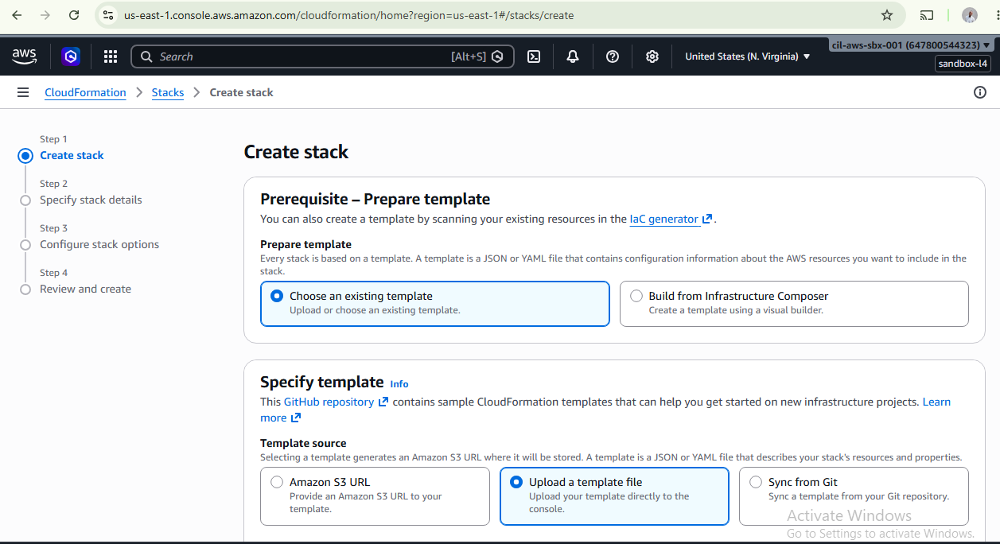
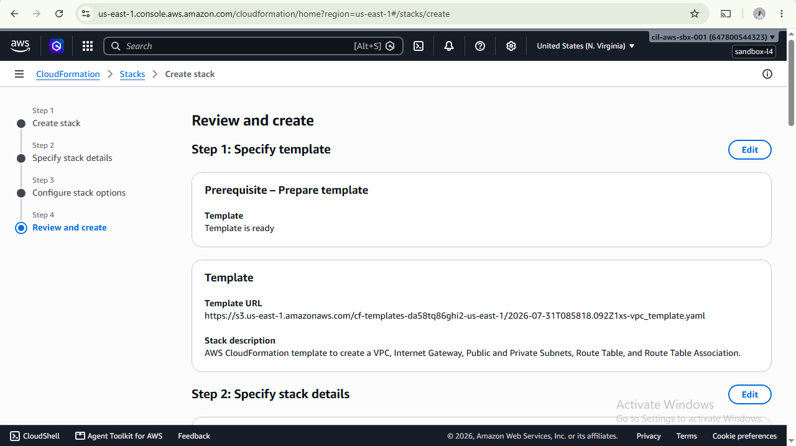
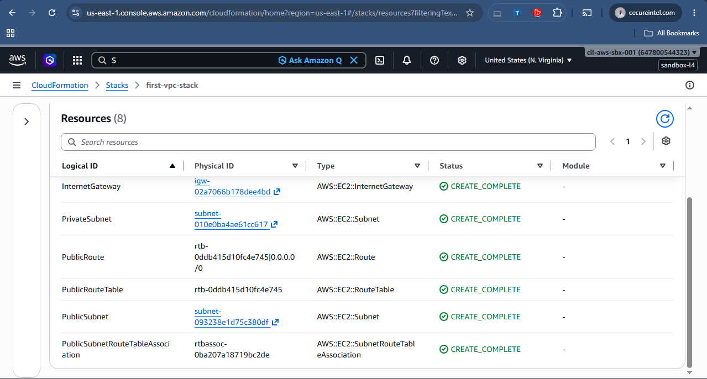
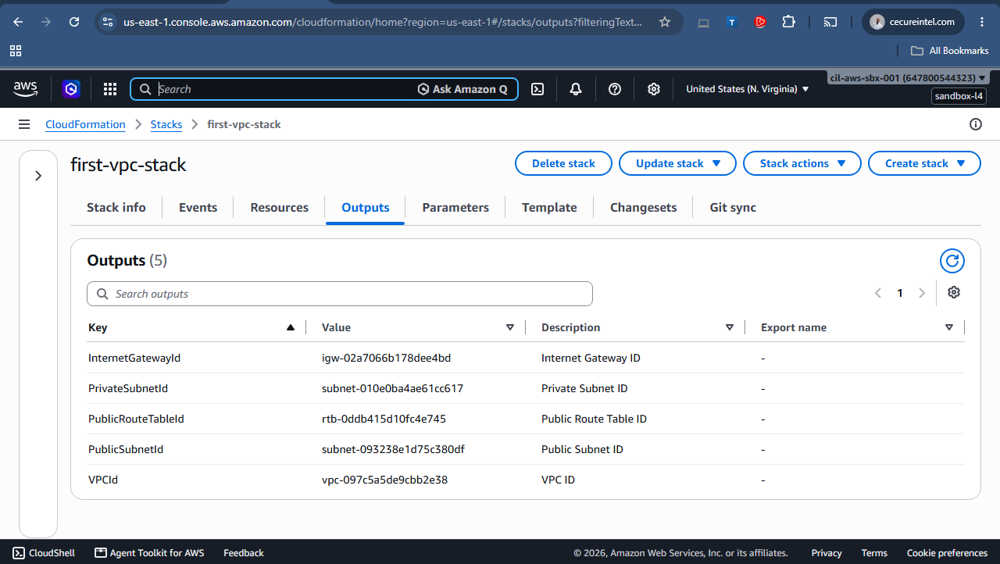
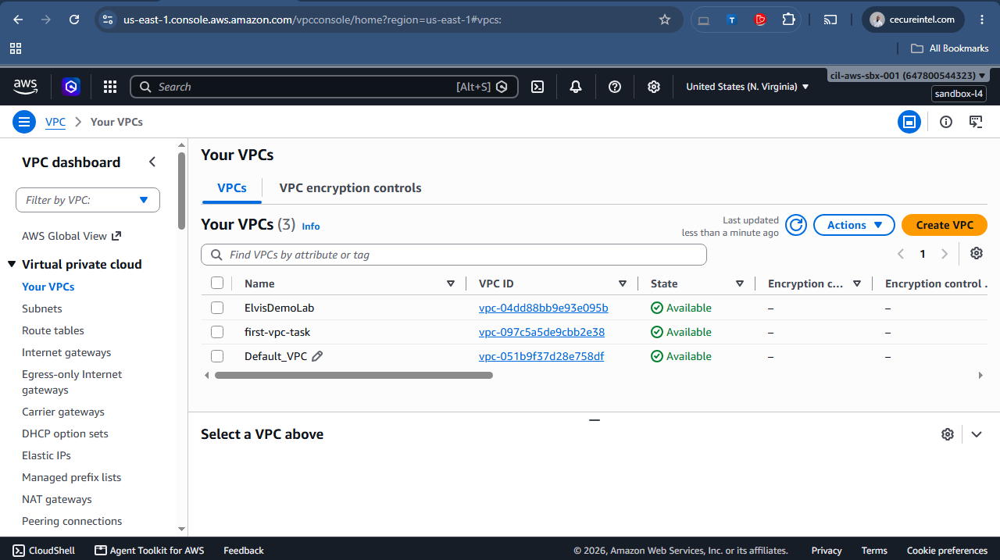
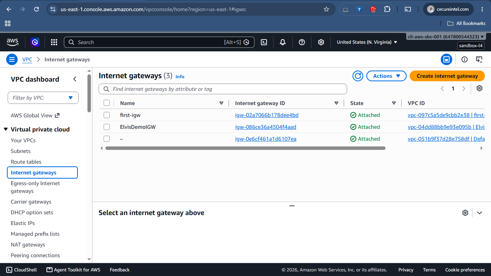
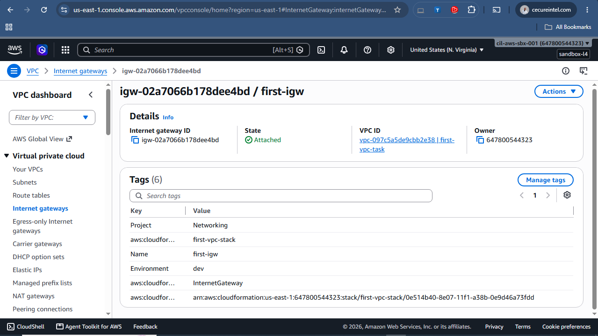
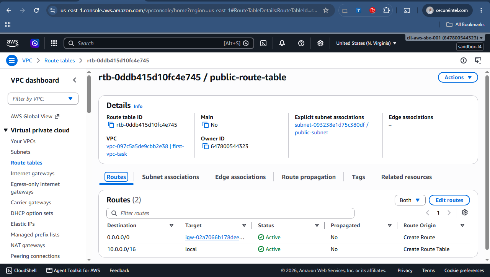
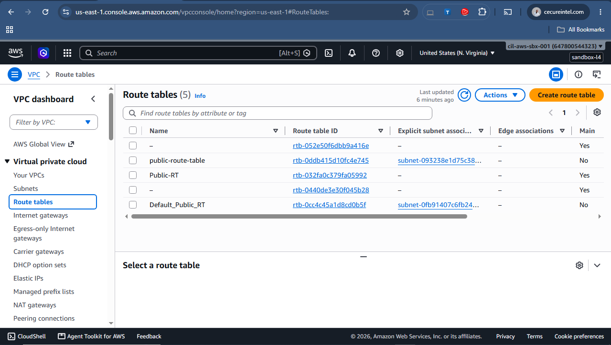

# AWS VPC Deployment using AWS CloudFormation

## Project Overview

This project demonstrates how to automate the deployment of a secure AWS Virtual Private Cloud (VPC) using AWS CloudFormation.

Instead of manually creating networking resources through the AWS Management Console, this project uses Infrastructure as Code (IaC) to provision the entire networking environment from a single YAML template.

The infrastructure includes a VPC, Internet Gateway, Public and Private Subnets, Route Table, Internet Route, and Route Table Association, following AWS networking best practices.

---
## Project Objectives

The objectives of this project are to:

- Learn Infrastructure as Code (IaC) using AWS CloudFormation.
- Automate AWS networking deployment.
- Create a secure Virtual Private Cloud (VPC).
- Configure public and private subnets.
- Configure Internet connectivity using an Internet Gateway.
- Configure routing using Route Tables.
- Understand how CloudFormation provisions AWS resources automatically.

## AWS Services Used

- AWS CloudFormation
- Amazon VPC
- Internet Gateway
- Route Tables
- Public Subnet
- Private Subnet

## Technologies Used

- AWS CloudFormation
- YAML
- AWS Management Console

## Resources Created

The CloudFormation template creates the following resources:

- VPC
- Internet Gateway
- Internet Gateway Attachment
- Public Route Table
- Internet Route
- Public Subnet
- Private Subnet
- Route Table Association

---

## Deployment Steps

1. Sign in to the AWS Management Console.
2. Open the CloudFormation service.
3. Click **Create Stack**.
4. Choose **With new resources (Standard)**.
5. Upload the `vpc_template.yaml` file.
6. Enter a stack name (for example: `first-vpc-stack`).
7. Leave the default options or configure tags if required.
8. Review the configuration.
9. Click **Submit** to create the stack.
10. Wait until the stack status changes to **CREATE_COMPLETE**.

## Verification

After deployment, verify the following resources:

- VPC created successfully.
- Internet Gateway attached to the VPC.
- Public and Private Subnets created.
- Route Table contains:
  - `10.0.0.0/16 → Local`
  - `0.0.0.0/0 → Internet Gateway`
- Public Subnet associated with the Public Route Table.
- Stack status is **CREATE_COMPLETE**.

---
## Screenshots

### CloudFormation Stack

### CloudFormation Resources

### CloudFormation Resources (Details)

### Stack Outputs

### VPC

---

### VPC Resource Details

---

### Internet Gateway

---

### Internet Gateway Details

---

### Public Route Table

---

### Route Table

---

