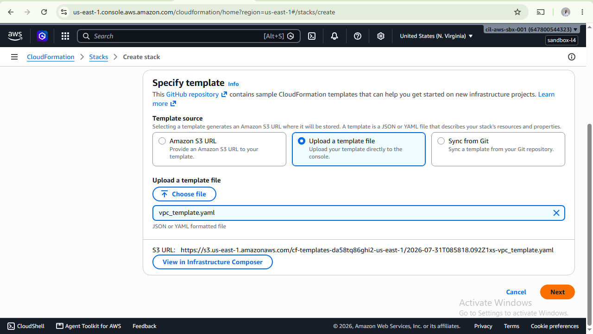
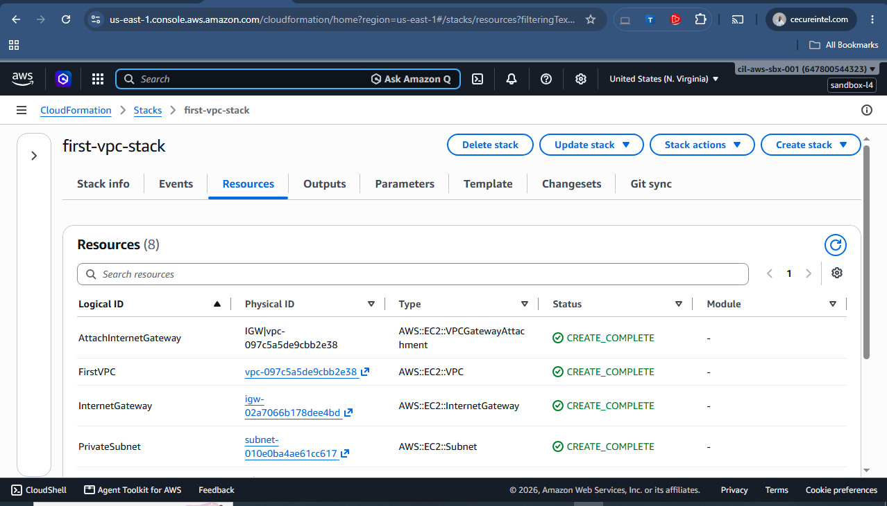
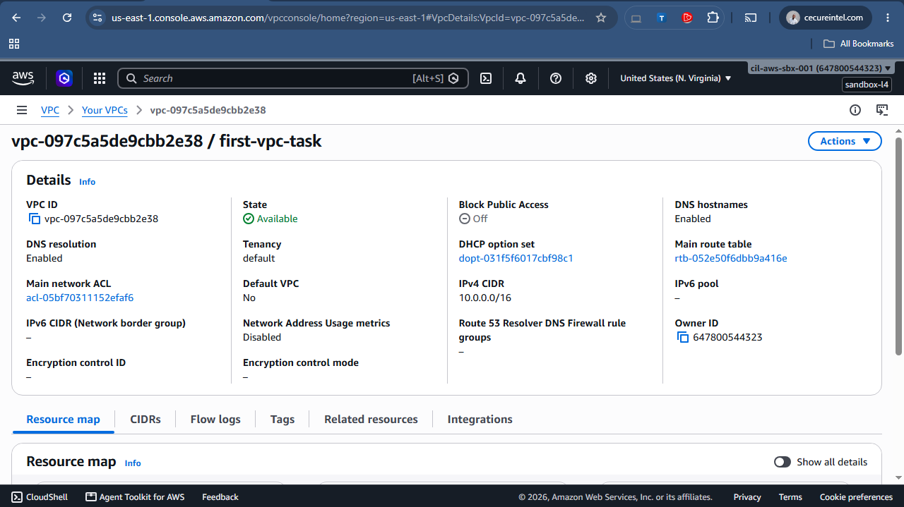

# 🚀 AWS VPC Deployment Using AWS CloudFormation

Automated deployment of an AWS Virtual Private Cloud (VPC) using AWS CloudFormation and Infrastructure as Code (IaC).

---

## 📖 Project Overview

This project demonstrates how to deploy an AWS Virtual Private Cloud (VPC) using AWS CloudFormation.

Instead of manually creating networking resources through the AWS Management Console, the entire infrastructure is provisioned from a single YAML template using Infrastructure as Code (IaC). This approach improves consistency, automation, and repeatability while following AWS networking best practices.

The CloudFormation template provisions:

- Amazon VPC
- Internet Gateway
- Public Subnet
- Private Subnet
- Public Route Table
- Internet Route
- Route Table Association

---

## 🎯 Project Objectives

- Learn Infrastructure as Code (IaC) using AWS CloudFormation.
- Automate AWS networking deployment.
- Create a secure Amazon VPC.
- Configure Public and Private Subnets.
- Configure Internet connectivity.
- Implement Route Tables and Route Table Associations.
- Gain hands-on experience deploying infrastructure from code.

---

## 🛠 AWS Services Used

| Service | Purpose |
|---------|---------|
| AWS CloudFormation | Infrastructure as Code |
| Amazon VPC | Virtual Network |
| Internet Gateway | Internet Connectivity |
| Route Table | Traffic Routing |
| Public Subnet | Internet-facing Resources |
| Private Subnet | Internal Resources |

---

## 💻 Technologies Used

- AWS CloudFormation
- YAML
- AWS Management Console

---

## 📦 Resources Created

- Amazon VPC
- Internet Gateway
- Internet Gateway Attachment
- Public Route Table
- Internet Route
- Public Subnet
- Private Subnet
- Route Table Association

---

# 🚀 Deployment

## Step 1 — Create the CloudFormation Stack

Upload the **vpc_template.yaml** file to CloudFormation to begin deployment.

---

## Step 2 — Configure the Stack

Provide the stack name and review the deployment configuration.

---

## Step 3 — Deployment Completed

CloudFormation successfully created every resource defined in the template.

---

# 📋 CloudFormation Resources

After deployment, CloudFormation automatically created all resources defined in the template.

## Resources

---

## Resource Details

---

# 📤 Stack Outputs

The Outputs section provides useful information exported after the deployment completed successfully.

---

# 🌐 Resource Verification

## Amazon VPC

The Amazon VPC provides the isolated network where all resources are deployed.

### VPC Overview

### VPC Details

---

## Internet Gateway

The Internet Gateway enables communication between the VPC and the Internet.

### Internet Gateway Overview

### Internet Gateway Details

---

## Public Route Table

The Public Route Table manages network traffic for the Public Subnet.

---

## Route Table Routes

The Route Table contains:

- **10.0.0.0/16 → Local**
- **0.0.0.0/0 → Internet Gateway**

---

## Public & Private Subnets

The CloudFormation template created two subnets:

| Public Subnet | Private Subnet |
|---------------|----------------|
| CIDR: 10.0.1.0/24 | CIDR: 10.0.2.0/24 |
| Internet Access | No Direct Internet Access |
| Associated with Public Route Table | Uses Local Route |

---

# ✅ Verification Checklist

- ✔️ VPC created successfully
- ✔️ Internet Gateway attached
- ✔️ Public Subnet created
- ✔️ Private Subnet created
- ✔️ Route Table created
- ✔️ Internet Route configured
- ✔️ Route Table Association completed
- ✔️ CloudFormation Stack status: **CREATE_COMPLETE**

---

